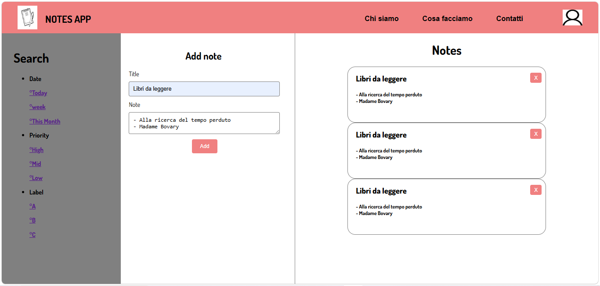

# Notes App 
Applicazione semplice e veloce per creare, modificare e cancellare note, con salvataggio automatico tramite localStorage e un’interfaccia pulita e intuitiva.

## Funzionalità
- Creazione di nuove note
- Modifica delle note esistenti
- Eliminazione delle note
- Salvataggio automatico tramite localStorage
- Interfaccia semplice e immediata

##  Tecnologie utilizzate
- HTML5
- CSS3
- JavaScript
- Localstorage
- Responsive design

##  Screenshot

##  Installazzione e utilizzo
1)  Clona la repository
git clone https://github.com/Anto037/Notes-App.git

2) Entra nella cartella del progetto
   cd Notes-App

3)  Apri il file index.html
   
Puoi farlo con un live server oppure direttamente dal browser.

##  Struttura del progetto
Notes-app/
│── assets/
│   ├── screen.PNG
│   ├── icone varie...
│
│── index.html
│── style.css
│── script.js
│── README.md

##  Autore
Antonio  Florea - 
Studente Web Developer – Verona, Italia

##  Licenza
Questo progetto è distribuito sotto licenza MIT.
